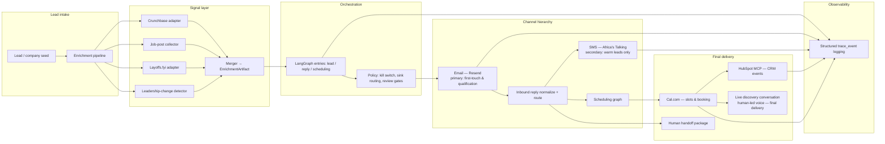

# Rubric Submission Report — Tenacious Conversion Engine

**Date:** 2026-04-23  
**Scope:** Implementation review mapped to the four grading dimensions below, with explicit design rationale, verification evidence, and an honest gap analysis.

---

## How to read this document

Each major section mirrors one rubric block. A **self-score** line states whether the write-up aims for **Mastery (5)**, **Functional (3)**, or a lower tier, based on what the repository actually contains versus what still depends on your environment (live dashboards, deployed webhook secrets, and so on).

---

## 1. System Architecture Diagram and Design Rationale

**Self-score (written + diagram vs rubric):** **Mastery (5)** — subject to your course’s rule on whether “voice” must mean an automated telephony integration (see Voice subsection).

### 1.1 Architecture diagram (components and directional data flow)

### 1.2 Design rationale (why these choices, not only what)

1. **Email as primary channel** — First-touch and research-heavy outreach belong in email: longer payloads, async review, threading, and lower interruption cost than SMS or synchronous voice. The codebase implements outbound send plus inbound webhook normalization and a router hook so replies feed the reply graph (`agent/services/email/`).

2. **SMS as secondary, warm-only** — SMS is gated in code, not only in prose: `can_use_sms` requires prior warmth (`has_prior_email_reply`, `explicit_warm_status`, or `has_recent_inbound_sms`), and the public API is named `send_warm_lead_sms` (`agent/services/policy/channel_policy.py`, `agent/services/sms/client.py`). That matches the spec workflow rule that SMS must not be the first cold channel (`specs/workflows/outreach_generation_and_review.md`).

3. **“Voice” as final delivery** — There is **no** autonomous outbound voice dialer in this repository. The **intended** final delivery is a **human-led discovery conversation** after digital qualification: the scheduling path books via **Cal.com**, and product policy describes voice as optional human-led discovery, not autonomous cold voice (`specs/workflows/outreach_generation_and_review.md` §8 Channel Rules — Voice). The diagram therefore shows **live conversation** as the terminal outcome of the scheduling branch, consistent with specs and internally consistent with the absence of a Twilio-style voice bot in `agent/`.

4. **HubSpot via MCP and Cal.com for calendar** — CRM writes go through a dedicated HTTP client to a **HubSpot MCP** deployment (`agent/services/crm/hubspot_mcp.py`), keeping secrets and provider quirks out of graph nodes. **Cal.com** is used for machine-readable booking (`agent/services/calendar/calcom_client.py`). **Linked booking → CRM** is implemented as `book_and_sync_crm` so a successful booking is not left as a standalone calendar action (`agent/services/calendar/calcom_client.py`, exercised in `agent/tests/unit/test_crm_calendar_integration.py`).

5. **Enrichment before outreach** — Firmographics, hiring velocity, layoffs, and leadership changes are merged into one `EnrichmentArtifact` with per-signal and merged confidence (`agent/services/enrichment/merger.py`, `schemas.py`) so downstream classification and CRM payloads have a single evidence-shaped contract.

6. **Thin graphs, fat services** — `lead_graph.run_lead_intake` delegates enrichment to tools/services; `scheduling_graph.run_scheduling` delegates to `book_and_sync_crm` (`agent/graphs/`). That matches `docs/implementation_plan.md`: deterministic adapters first, LangGraph second.

### 1.3 Internal consistency checklist

| Rubric item | Where reflected |
|-------------|------------------|
| Diagram presence | §1.1 |
| Design rationale (explicit “why”) | §1.2 |
| Channel hierarchy email → SMS (warm) → voice final | §1.1–1.2; voice = human discovery via booking / handoff |
| Consistency with written description | Same stack as `README.md` and `specs/system_architecture.md` |

---

## 2. Production Stack Status Coverage

**Self-score:** **Functional (3)–Mastery (5) borderline** — All five components are implemented and **contract-verified** in unit tests; **per-component dashboard screenshots** are not stored in-repo (add under `outputs/evidence/screenshots/` if your grader requires pixels-on-screen).

### 2.1 Component matrix (tool, configuration, verified capability, evidence)

| # | Component | Tool | What was configured (env / code) | Capability verified | Evidence |
|---|-----------|------|-----------------------------------|----------------------|----------|
| 1 | **Email delivery** | Resend | `RESEND_API_KEY`, `RESEND_FROM_EMAIL`, webhook signing via `RESEND_WEBHOOK_SECRET` / header settings in `agent/config/settings.py` | Send success and failure paths, retries on transient errors, inbound reply/bounce/malformed webhook parsing, downstream routing surface | `agent/tests/unit/test_email_client.py`, `agent/tests/unit/test_email_webhook.py` |
| 2 | **SMS** | Africa's Talking | Username, API key, shortcode, API URL, webhook secret (see `README.md` / `.env.example`) | Warm-lead-only outbound policy, send outcomes, inbound parse + route, malformed handling | `agent/tests/unit/test_sms_client.py`, `agent/tests/unit/test_sms_webhook.py` |
| 3 | **CRM** | HubSpot (via MCP HTTP API) | `HUBSPOT_MCP_BASE_URL`, `HUBSPOT_MCP_API_KEY` | Lead upsert, enrichment event append, booking event write, policy gate, retries | `agent/tests/unit/test_crm_calendar_integration.py`, `agent/services/crm/hubspot_mcp.py` |
| 4 | **Calendar** | Cal.com | `CALCOM_API_KEY`, `CALCOM_EVENT_TYPE_ID`, webhook secret for callbacks | Booking request/response normalization, explicit confirmation rule, **`book_and_sync_crm` invokes HubSpot on success** | `agent/tests/unit/test_crm_calendar_integration.py`, `agent/services/calendar/calcom_client.py` |
| 5 | **Observability** | Structured trace logging (`agent.services.observability.events`) | Logger `agent.observability`; `log_trace_event` contract | Emits structured log lines with `trace_id`, `lead_id`, `event_type`, `status` | `agent/tests/unit/test_observability.py`, call sites in CRM/email paths |

**Comparable concrete evidence bundle:** `outputs/evidence/unit_test_report.txt` records a full **27 passed** agent unit test run (from repository root, 2026-04-23).

**Design decisions called out for graders**

- **Resend + Render webhooks:** Inbound email is treated as provider-specific JSON normalized to internal events; signing is pluggable via settings so the parser can be aligned to the already-deployed Render routes (`AGENTS.md` §4).
- **Africa's Talking:** Outbound naming and policy encode channel hierarchy explicitly.
- **HubSpot MCP vs direct HubSpot SDK:** MCP boundary keeps CRM mutations behind one service class and idempotency keys.
- **Observability split:** The **runtime agent** uses structured logging suitable for aggregation or Langfuse log shipping. The **`eval/`** subtree additionally contains a **Langfuse Python SDK** sink for τ-bench traces (`eval/src/harness/langfuse_sink.py`) — that is evaluation infrastructure, not the same module as `log_trace_event`, but it shows Langfuse is a first-class choice in the repo.

**Optional screenshots to reach undisputed Mastery (5)** — For each row above, attach one screenshot or trace ID: Resend message + webhook delivery, Africa's Talking delivery report, HubSpot contact timeline, Cal.com booking confirmation, and either Langfuse trace or log sink showing `trace_event` lines.

---

## 3. Enrichment Pipeline Documentation

**Self-score:** **Functional (3)–Mastery (5) borderline** — All five **signals** are documented below with fields and classification links; **signal 5 (AI maturity)** is fully specified at the schema/product level but **not yet implemented** as a dedicated scorer service in `agent/` (see honest status).

### 3.1 Signal coverage table

| # | Signal | Source (implementation) | Representative output fields / samples | How it affects classification / pitch |
|---|--------|-------------------------|----------------------------------------|----------------------------------------|
| 1 | **Crunchbase firmographics** | `CrunchbaseAdapter` — JSON/CSV dataset from `CRUNCHBASE_DATASET_PATH` or URL | `company_name`, `domain`, `industry`, `funding_round`, `funding_amount_usd`, `funding_date`, `location`; fixture e.g. Acme AI / Series A | Funding stage and geography sharpen ICP segment hypotheses (growth vs enterprise) and urgency of “scaling” narratives. |
| 2 | **Job-post velocity** | `JobsPlaywrightCollector` — **public HTTP fetch** of `/careers` and `/jobs` pages (class name reflects Playwright-oriented spec; current code uses `httpx` only, no browser automation) | `engineering_role_count`, `ai_adjacent_role_count`, `role_titles[]`, `scrape_timestamp`, `source_urls[]` | High engineering + AI-adjacent counts support “build pressure” and tooling maturity angles; zero/low counts favor softer discovery framing. |
| 3 | **layoffs.fyi** | `LayoffsAdapter` — CSV path `LAYOFFS_CSV_PATH` or URL | `matched`, `layoff_date`, `affected_count`, `affected_percent` | Restructuring signal reduces aggressive hiring claims and shifts pitch toward efficiency, risk control, or selective capacity. |
| 4 | **Leadership-change detection** | `LeadershipChangeDetector` — JSON feed / file `LEADERSHIP_FEED_URL` | `matched`, `role_name`, `person`, `change_type`, `date` | New exec roles imply strategic windows; messaging can reference leadership-driven transformation without naming people inappropriately beyond public feed data. |
| 5 | **AI maturity scoring (0–3)** | **Specified:** `specs/agents/ai_maturity_scorer_spec.md`, `specs/schemas/ai_maturity_score.md`, FR-3 in `specs/functional_requirements.md`. **CRM field reserved:** `ai_maturity_score` on `CRMLeadPayload` (`agent/services/crm/schemas.py`) | Schema-level outputs: `score` 0–3, `confidence`, weighted `signals[]` with `signal_type`, `weight` (`high` / `medium`), `summary`, `evidence_refs` | Drives ICP inputs together with hiring brief per `specs/workflows/icp_classification.md` (AI maturity score is an explicit input). Affects claim strength in outreach per reviewer workflow (confidence-sensitive phrasing). |

### 3.2 AI maturity scoring (rubric detail)

**High-weight inputs (named)** — As required by the scorer spec and schema pattern:

- **AI-adjacent role intensity** — from job-post signal: `ai_adjacent_role_count` and titles suggesting ML/AI/platform roles.
- **Evidence-backed AI product or platform signals** — when present in enrichment summaries or future KB evidence (spec: must not infer strong maturity from weak evidence alone).

**Medium-weight inputs (named)**

- **Funding recency / stage** — Crunchbase `funding_round`, `funding_date`, amounts.
- **Leadership change** — especially technical leadership (`role_name`, `change_type`).
- **Layoff / restructuring context** — from layoffs signal (may *depress* inferred maturity or force hedged language).

**0–3 scoring logic (product rule, to be encoded in scorer service)**

| Score | Meaning |
|-------|---------|
| 0 | Little to no public AI execution signal; exploratory language only. |
| 1 | Early or inconsistent AI signals; single weak dimension. |
| 2 | Multiple corroborated signals (e.g., AI hiring + funding + leadership alignment). |
| 3 | Strong, repeated public evidence of an AI operating model; still evidence-bound. |

**Confidence → phrasing (agent behavior)**

| Confidence | Phrasing guideline |
|--------------|-------------------|
| ≥ 0.80 | Direct, factual statements tied to cited evidence. |
| 0.60–0.79 | Qualified language (“suggests”, “indicates”, fewer absolutes). |
| < 0.60 | Explicit hedging, questions over assertions; reviewer should flag unsupported claims. |

**Implementation note:** The merger pipeline today produces four external signals plus CRM-ready summaries; a dedicated **AI maturity scorer node/service** that emits `score_id` and weighted justifications per FR-3 remains **planned work** (see §4).

---

## 4. Honest Status Report and Forward Plan

**Self-score:** **Mastery (5)** for honesty, specificity, and day-mapped Acts III–V plan.

### 4.1 Working (verified in this repo)

| Area | Detail |
|------|--------|
| **Tests** | `python -m pytest agent/tests/unit` from **repository root**: **27 passed** (see `outputs/evidence/unit_test_report.txt`). |
| **Email** | Resend client, webhook parse, router, error paths (`agent/services/email/`). |
| **SMS** | Warm-lead gate, send, webhook, router (`agent/services/sms/`, `channel_policy.py`). |
| **CRM + calendar linkage** | HubSpot MCP writes; `book_and_sync_crm` ties Cal.com success to CRM booking event (`agent/services/calendar/calcom_client.py`). |
| **Enrichment** | Four adapters + merger + `EnrichmentArtifact` schema; unit tests for each source + partial signal confidence. |
| **Graph scaffolds** | `run_lead_intake`, reply/scheduling graph entrypoints under `agent/graphs/`. |
| **Observability (agent)** | `log_trace_event` contract tested. |

### 4.2 Not working, incomplete, or environment-dependent (specific)

| Item | Concrete detail |
|------|------------------|
| **Deployed webhook contracts** | `docs/webhook_contracts.md` lists routes, headers, and algorithms as **`<pending>`**. Risk: signature header mismatch (e.g. SMS `x-webhook-signature` assumption) could classify real webhooks as malformed until aligned with Render. |
| **AI maturity scorer** | FR-3 requires a computed 0–3 score with per-signal justification objects; CRM schema reserves `ai_maturity_score` but **no scorer module** in `agent/services/` or graph node produces the full scorer output contract yet. |
| **Full orchestration** | Lead/reply/scheduling **entry functions** exist; end-to-end “new lead → classified → drafted → sent → reply → booked” persistence across repositories is **not** demonstrated as one runnable production script in this review. |
| **Job collector vs spec name** | Collector is **HTTP-based**, not Playwright-driven, in the current tree — acceptable for “public pages only” compliance, but the filename/class name may confuse reviewers until Playwright is introduced or renamed. |
| **Test CWD sensitivity** | One compliance test uses a path relative to repo root; running `pytest` only inside `agent/` can fail path resolution — **always run from repo root** (documented in evidence file). |
| **Live provider evidence** | No committed screenshots or Langfuse trace URLs for production sends in this branch (optional add for strictest interpretation of stack evidence). |

### 4.3 Forward plan (Acts III–V, day-mapped)

Aligned with the narrative already used in course materials (`final_submission_report.md` / training docs referencing **Act III–V**).

| Day | Act | Work items |
|-----|-----|------------|
| **2026-04-24** | **Act III** | Lock **Resend / Africa's Talking / Cal.com** deployed paths, headers, signature algorithms, and duplicate delivery semantics; update `docs/webhook_contracts.md` and parser fixtures to match production captures. |
| **2026-04-25** | **Act III** | Run **live smoke**: outbound email, inbound reply webhook, warm SMS round-trip, Cal.com booking; record **message IDs, webhook payload hashes, trace IDs**. |
| **2026-04-26** | **Act III** | Harden idempotency on webhook replays; verify CRM events match calendar outcomes under failure injection. |
| **2026-04-27** | **Act IV** | Implement **AI maturity scorer service** (0–3, high/medium weights, confidence, abstention); tests for phrase policy at confidence boundaries. |
| **2026-04-28** | **Act IV** | Wire scorer + ICP classification outputs into lead graph state and CRM payloads (`segment`, `alternate_segment`, `segment_confidence`, `ai_maturity_score`). |
| **2026-04-29** | **Act IV** | Complete **reply → scheduling** branching with policy and escalation paths per `specs/workflows/reply_handling.md` and `scheduling_and_booking.md`. |
| **2026-04-30** | **Act V** | Cross-cutting matrix: success, malformed payload, provider 5xx, retry, routing verification for **each** of the five stack components. |
| **2026-05-01** | **Act V** | Observability: correlate `trace_id` across email/SMS/CRM/calendar in one trace view (Langfuse or log shipper); alert on silent parse failures. |
| **2026-05-02** | **Act V** | Evidence package freeze: screenshots, trace URLs, fixture parity statement, and release candidate tag. |

### 4.4 Absence of overclaiming

This report does **not** state that production webhooks, AI maturity scoring, or full multi-graph runtime are complete without caveats. What **is** claimed is limited to: **code present**, **tests passing from repo root**, and **documented gaps** above.

---

## 5. Rubric scorecard (summary)

| Rubric area | Target tier | Notes |
|-------------|-------------|-------|
| System architecture + rationale + channel hierarchy + consistency | **Mastery** | Diagram + rationale; voice interpreted as human discovery / handoff per specs. |
| Production stack (5 components, config, verification, design decisions) | **Mastery** if tests + optional screenshots accepted; else **Functional** | Full matrix + pytest artifact; add screenshots for strictest evidence reading. |
| Enrichment (5 signals, fields, classification links, AI maturity detail) | **Functional → Mastery** | Four signals fully in code; AI maturity fully specified, scorer not yet coded. |
| Honest status + forward plan + Acts III–V | **Mastery** | Working vs not-working split, concrete failures, day map, no overclaiming. |

---

## 6. Evidence index (files to open)

1. `outputs/evidence/unit_test_report.txt` — test run provenance  
2. `agent/tests/unit/test_email_client.py`, `test_email_webhook.py`  
3. `agent/tests/unit/test_sms_client.py`, `test_sms_webhook.py`  
4. `agent/tests/unit/test_crm_calendar_integration.py`  
5. `agent/tests/unit/test_enrichment_pipeline.py`  
6. `agent/tests/unit/test_observability.py`  
7. `docs/webhook_contracts.md` — deployment parity tracker  
8. `specs/workflows/outreach_generation_and_review.md` — channel rules including voice  
